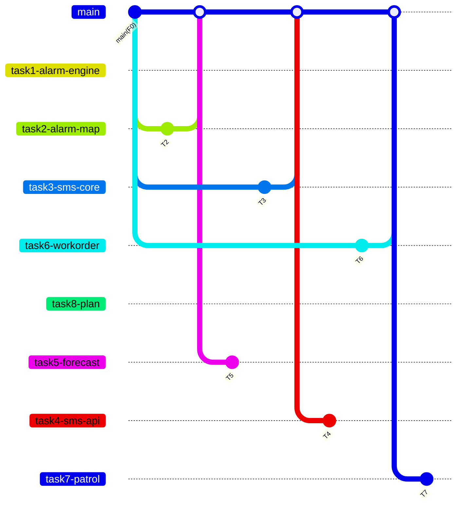

# Dev-2 处置流 — Task 分支索引

> **For agentic workers:** 本文件是索引。每个原计划 Task 对应一份子计划、一条 Git 分支。实施时打开对应 `Dev-2-taskN-*.md`，REQUIRED SUB-SKILL: Use superpowers:subagent-driven-development（推荐）或 executing-plans。

**Goal:** 实现供暖管网的预警、预报、工单、预案与短信通知闭环（消费 Dev-1 的 Kafka `heat-alarm-topic`，向 `sms-notify-topic` 产出短信请求），并提供对应 API 与前端页面。

**Architecture:** 基于 F0 共享脚手架（`main.py` 已锁定，`/api` 前缀）。原《Dev-2-处置流》8 个 Task **一 Task 一分支一 PR**。运行时靠 Kafka / HTTP / 库表协作，不跨 Task import 对方未合入的模块。

**Tech Stack:** Python 3.10+ / FastAPI / scikit-learn(joblib)；Spark3/Hive；Kafka；MySQL8/Redis7/ES。前端 Vue3+TS+Vite+ElementPlus+ECharts。

---

## 分支一览（按原 Task 1–8）

| Task | 分支名 | 子计划 | 从哪切 | 文件冲突 |
|---|---|---|---|---|
| 1 | `dev-2/feature/task1-alarm-engine` | [Dev-2-task1-alarm-engine.md](./Dev-2-task1-alarm-engine.md) | `main` | 无，可并行 |
| 2 | `dev-2/feature/task2-alarm-map` | [Dev-2-task2-alarm-map.md](./Dev-2-task2-alarm-map.md) | `main` | 与 Task 1 无文件重叠；与 Task 5 抢 `routes_alarm.py` |
| 3 | `dev-2/feature/task3-sms-core` | [Dev-2-task3-sms-core.md](./Dev-2-task3-sms-core.md) | `main` | 无，可并行 |
| 4 | `dev-2/feature/task4-sms-api` | [Dev-2-task4-sms-api.md](./Dev-2-task4-sms-api.md) | **Task 3 合入后的 `main`**（或叠在 Task 3 上） | import `sms_service` |
| 5 | `dev-2/feature/task5-forecast` | [Dev-2-task5-forecast.md](./Dev-2-task5-forecast.md) | **Task 2 合入后的 `main`**（或叠在 Task 2 上） | 追加 `routes_alarm.py` |
| 6 | `dev-2/feature/task6-workorder` | [Dev-2-task6-workorder.md](./Dev-2-task6-workorder.md) | `main` | 与 Task 7 抢 `routes_workorder.py` |
| 7 | `dev-2/feature/task7-patrol` | [Dev-2-task7-patrol.md](./Dev-2-task7-patrol.md) | **Task 6 合入后的 `main`**（或叠在 Task 6 上） | 追加 `routes_workorder.py` |
| 8 | `dev-2/feature/task8-plan` | [Dev-2-task8-plan.md](./Dev-2-task8-plan.md) | `main` | 无，可并行 |

可从 `main` **同时开**的 5 条：Task 1、2、3、6、8。

必须等前置合入（或叠分支）的 3 条：Task 4 ← 3，Task 5 ← 2，Task 7 ← 6。

```bash
git checkout main && git pull
git checkout -b dev-2/feature/task1-alarm-engine
```

叠分支示例（Task 3 尚未合入 main 时提前做 Task 4）：

```bash
git checkout dev-2/feature/task3-sms-core
git checkout -b dev-2/feature/task4-sms-api
```



---

## 文件所有权（一 Task 独占，禁止跨分支改）

| Task | 独占文件 |
|---|---|
| 1 | `src/python/services/alarm_engine.py`、`consumers/alarm_consumer.py`、`tests/test_alarm_engine.py` |
| 2 | `src/python/routes_alarm.py`（只写 `/alarm/list` `/alarm/ack`）、`tests/test_alarm_routes.py`、`web/src/pages/alarm/AlarmMap.vue`、`web/src/services/alarm.api.ts`、`web/src/mock/alarm.mock.ts` |
| 3 | `src/python/services/sms_service.py`、`consumers/sms_consumer.py`、`tests/test_sms_service.py` |
| 4 | `src/python/routes_sms.py`、`tests/test_sms_routes.py`、`web/src/pages/sms/TemplateManage.vue`、`web/src/services/sms.api.ts`、`web/src/mock/sms.mock.ts` |
| 5 | `src/python/services/forecast.py`、`heat_train_model.py`、`tests/test_forecast.py`；`routes_alarm.py` **仅追加** `/forecast/list` |
| 6 | `src/python/services/workorder.py`、`routes_workorder.py`（只写 create/get）、`tests/test_workorder.py` |
| 7 | `src/python/services/patrol.py`、`tests/test_patrol.py`；`routes_workorder.py` **仅追加** `/patrol/plan/generate`；`web/src/pages/workorder/*`、`web/src/services/workorder.api.ts`、`web/src/mock/workorder.mock.ts` |
| 8 | `src/python/services/plan.py`、`routes_plan.py`、`tests/test_plan.py`、`web/src/pages/plan/PlanManage.vue`、`web/src/services/plan.api.ts`、`web/src/mock/plan.mock.ts` |

**全 Task 禁止修改：** `main.py`、`kafka_topics.py`、`response.py`、`db.py`、`config/settings.py`、`config/mysql/heat_init.sql`、`web/src/router/index.ts`、`web/src/components/*`、`tests/test_scaffold.py`、Dev-1 的 `routes_heat.py` / `routes_twin.py` / `routes_public.py`。

**路由路径：** `main.py` 只挂 `prefix="/api"`。各 `routes_*.py` 写完整路径，例如 `@router.get("/alarm/list")` → `GET /api/alarm/list`。不要给 `APIRouter(prefix="/alarm")`。

**`services/` / `consumers/`：** 只新增本 Task 的 `.py`，不要创建 `__init__.py`。

**`tests/test_scaffold.py`：** 空桩断言会在第一个合入路由的 Task 后失败。在 **main 上单独 chore** 放宽，不要 8 条分支同时改它。

---

## Global Constraints

- 后端 Python 3.10+ / FastAPI；前端 Vue3+TS 2 空格缩进。
- 命名：类大驼峰、函数/变量小驼峰、常量全大写下划线；无拼音缩写；标识符英文。
- 所有外部输入做类型/长度/格式/合法性校验；SQL 参数化/ORM，禁止字符串拼接。
- 敏感信息走环境变量，禁止硬编码；手机号脱敏 `138****1234`。
- 统一响应：`{"code":0,"message":"ok","data":{...}}`；错误码：0 成功/40001 参数校验失败/40002 资源不存在/40003 权限不足/50001 服务内部错误/50002 模型未加载/50003 短信网关失败。
- 中文沟通、英文代码；注释说明意图不冗余。
- **表结构以 `config/mysql/heat_init.sql` 现状为准**，各分支禁止改该文件。
- Topic 常量（`HEAT_ALARM_TOPIC`、`SMS_NOTIFY_TOPIC`）由 F0 提供，只读使用。

---

## 建议开工

1. 同时从 `main` 开 Task 1 / 2 / 3 / 6 / 8。
2. Task 3 合入后开 Task 4；Task 2 合入后开 Task 5；Task 6 合入后开 Task 7。
3. commit / PR 前缀与原计划一致：`feat(4.1)` / `feat(sms)` / `feat(4.2)` / `feat(9.x)` / `feat(5.1)`。
